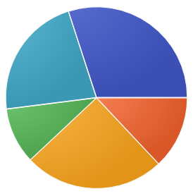

# measure

Note:

The most important step in performance is to measure what you care about.
What do we measure? and how?

# bizness

1. cost (how much money are we paying out?)
2. revenue (how much money are we getting paid?)

Note:

As a business, there's one thing we care about.
Money!
We care about how much things cost, and how much money we make.
For the business, improving the performance of the business is about increasing revenue and decreasing costs.
A business is, at heart, a system, and all systems can be measured.

# systems

1. speed (how much time does it need?)
2. size (how much space does it need?)
3. throughput (how much can we get done in a period of time?)
4. latency (how long does it take to get something done?)

Note:

I don't know business very well.
I do know software pretty well.
Fortunately, a lot of what I'm talking about is pretty general!
It's rooted in computer science and mathematics, but we can apply it to almost anything.

When we optimize a system, we can measure raw speed, space requirements, how much stuff we can get done at once, and how long it takes us to do a single thing.
A lot of these things are related.
We can often trade one attribute for another.

# measuring speed

$$\frac{jobs}{time}$$

Note:

We measure speed by saying "how much time does a job take."
So, to measure speed, we can simply count how many jobs we can do in an hour.
When we divide that, we get the rate!

# measuring size

$$\text{small} = \frac{10 jobs}{\text{sum of resource we care about}}$$

$$\text{large} = \frac{100 jobs}{\text{sum of resource we care about}}$$

$$\frac{\text{small}}{\text{large}}$$

Note:

When we measure the size of a problem, we measure how many jobs we do, and then we divide it by the number of resources that it took.
A resource can be the number of people, the number of computers, the number of systems, the amount of computer RAM, or the amount of money.
It can also be time.

# what matters?

Note:

So, the first step in improving performance is identifying what matters.
As it happens, this involves the exact same scientific process that we did earlier!
We have to identify the components of our system.
These are often going to be entire systems themselves!

All systems are composed of systems.
It's turtles all the way down.

# pie charts are cool

Note:

A pie chart is a helpful way to visualize this process.
We might decide that we care about the time that a process takes, and that we want to make it faster.
So we'll take all of the subcomponents of the process, and measure how long they take.

We might decide that we care about the money that a process costs, and that we want to make it cheaper.
So we'll take all of the subcomponents of the process, and measure how much money they cost.

# bottlenecks

# rule everything 

# around me

Note:

In every case, the most important thing to do is identify the bottleneck.
If we spend our time optimizing other stuff, then we're minimizing the amount of impact we have.

# amdhal's law

$$Speedup = \frac{1}{(1 - p) + \frac{p}{s}}$$

- $p$ = proportion of time spent doing thing we're improving
- $s$ = speedup of the specific thing we're improving

Note:

A brilliant computer architect named Gene Amdahl came up with Amdahl's Law.
This math basically says that, for any improvement we make to a component of the system, the total speedup of the system is limited by the proportion of time that we're involved in that component.

# Optimize:

Business analysts spend:

- 90% of time spent reading reports
- 10% of time spent writing reports

Which to do?

1. Make writing reports twice as fast
2. Make reading reports only 20% faster

Note:

Let's do a practical example.
Our business analysts might spend 90% of their time reading reports, and 10% writing reports.
We can choose to do two optimizations:
one is very impressive! It makes writing reports 90% faster.
The other seems less impressive.
We'd only make the analysts 20% faster at reading reports.

## Option 1

$$Speedup_1 = \frac{1}{(1 - 0.1) + \frac{0.1}{2}}$$
$$Speedup_1 = \frac{1}{0.9 + 0.05}$$
$$Speedup_1 = \frac{1}{0.905}$$
### Final:
$$Speedup_1 = 1.05$$
or
5%

Note:

This is what we get when we plug in the math for the first choice.
If we make writing reports twice as fast, then we only get a 5% speedup.
That's not very good! The whole system is barely faster, even though we dramatically improved the speed of one part.

## Option 2

$$Speedup_2 = \frac{1}{(1 - 0.9) + \frac{0.9}{1.2}}$$
$$Speedup_2 = \frac{1}{0.1 + 0.75}$$
$$Speedup_2 = \frac{1}{0.85}$$
### Final:
$$Speedup_2 = 1.176$$
or
17%!!

Note:

This is what we get when we plug in the math for the second choice.
If we make reading reports 20% faster, then we get a much larger 17% speedup.
That's an improvement that is three times greater than the other one!
This is because we spend the majority of our time reading reports.

On a work project, I identified that one of our workers was spending most of it's time talking to a specific internal API service.
I changed the API to one that was about 10-20 times faster.
The improved performance allowed us to cut the worker fleet in half.
Now, the bottleneck is something totally different, so further performance improvements would need to attack those areas.
